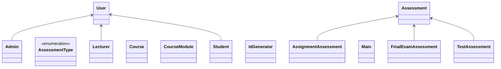

```mermaid
classDiagram
direction BT
class Admin
class Assessment
class AssessmentType {
<<enumeration>>

}
class AssignmentAssessment
class Course
class CourseModule
class FinalExamAssessment
class IdGenerator
class Lecturer
class Main
class Student
class TestAssessment
class User

Admin  -->  User 
AssignmentAssessment  -->  Assessment 
FinalExamAssessment  -->  Assessment 
Lecturer  -->  User 
Student  -->  User 
TestAssessment  -->  Assessment 
```