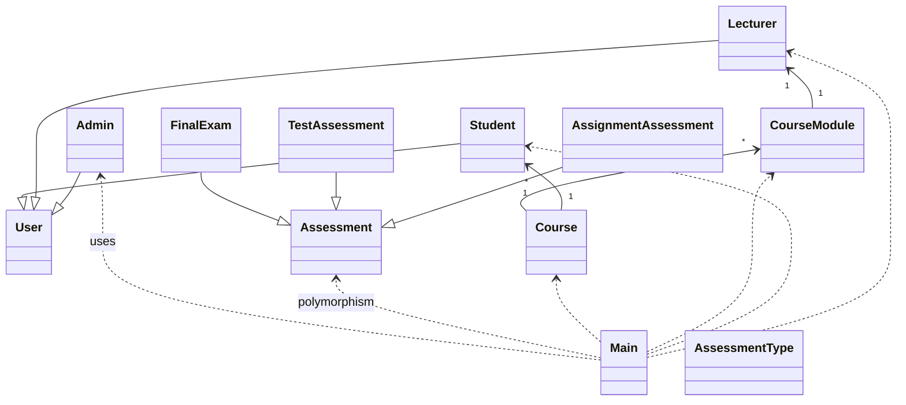

```mermaid
classDiagram
direction BT

class User
class Student
class Lecturer
class Course
class CourseModule
class Assessment
class FinalExam
class TestAssessment
class AssignmentAssessment
class Admin
class Main
class AssessmentType

User <|-- Student
User <|-- Lecturer
User <|-- Admin

Course "1" --> "*" CourseModule
Course "1" --> "*" Student
CourseModule "1" --> "1" Lecturer

Assessment <|-- FinalExam
Assessment <|-- TestAssessment
Assessment <|-- AssignmentAssessment

Main ..> Admin : uses
Main ..> Assessment : polymorphism
Main ..> Course
Main ..> CourseModule
Main ..> Student
Main ..> Lecturer

```