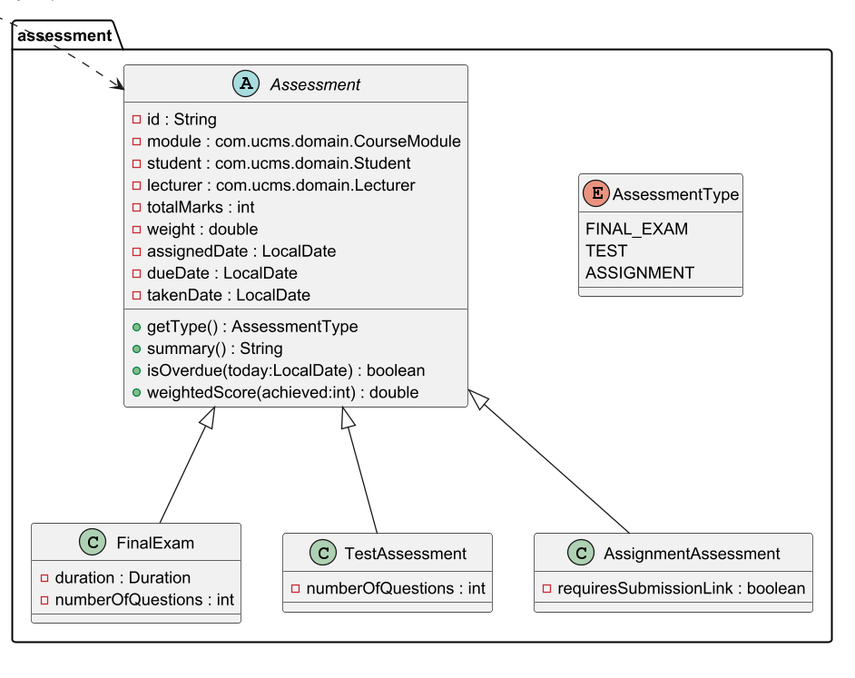
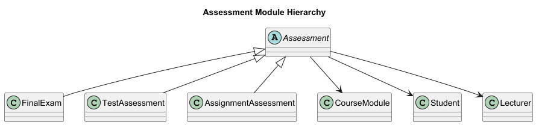
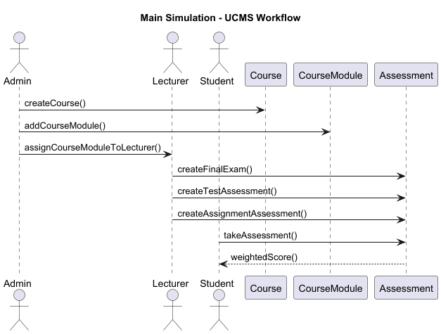
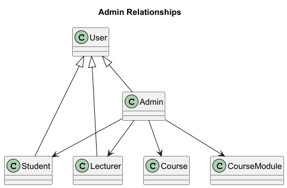
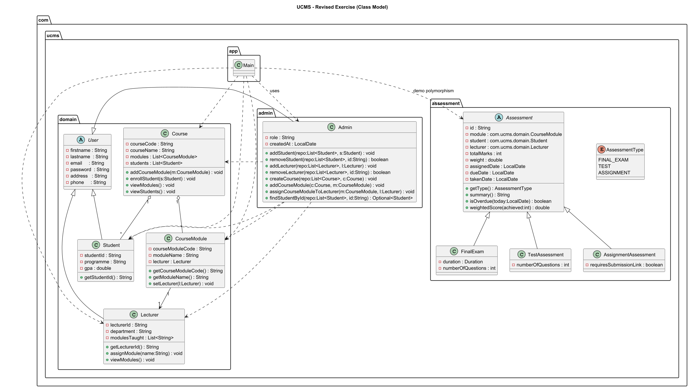

# University Coursework Management System (UCMS) — Exercise 1 (Revised Version)

**Student Name:** Michael McKibbin<br>
**Module:** Software Development<br> 
**Module Code:** SWDE_IT803 - LY_ICSWD_B 2025/2026<br>
**Lecturer:** Lusungu Mwasinga<br>
**Date:** 26th October 2025<br>

---

## 1. Overview

This project implements the revised version of Exercise 1, the **University Coursework Management System (UCMS)** in Java.  
It demonstrates core **Object-Oriented Programming (OOP)** principles — *encapsulation, inheritance, polymorphism, abstraction,* and *composition* — through three main components:

1. **Assessment Module** – an abstract base class `Assessment` and three concrete subclasses:  
   - `FinalExam`, 
   - `TestAssessment`, and 
   - `AssignmentAssessment`.
   
   Each assessment records details such as ID, student, module, lecturer, total marks, weight, assigned/due dates, and provides behaviours for displaying details, checking overdue status, and calculating weighted scores. 
   <br><br>
2. **Administration Module** – the `Admin` class extends `User` and includes multiple constructors demonstrating **constructor chaining**. Linking the no-argumant, partial, and full constructors, ensures that all initialisation follows the same logic path resulting in consistent object set-up.    
   Manages in-memory collections of students, lecturers, courses, and course modules, supporting actions such as:
    - Adding/removing students and lecturers
    - Creating courses
    - Adding course modules to courses
    - Assigning course modules to lecturers
      <br><br>   
3. **Main Application** – Demonstrates realistic interactions between users, showing the relationships and operations among `Admin`, `Lecturer`, `Student`, `Course`, `CourseModule`, and various assessments.

---

## 2. Project Structure (Packages)
Using packages to group real-world models together:


| Package              | Purpose                                                         |
|:---------------------|:----------------------------------------------------------------|
| com.ucms.domain      | Core business entities (students, lecturers, courses, modules)  |
| com.ucms.assessment  | Logic for coursework and grading                                |
| com.ucms.admin       | Management operations (user/course handling)                    |
| com.ucms.support     | Utility classes (e.g., IdGenerator)                             |                                                                                    
| com.ucms.app         | Application entry point and runtime coordination                |                                                                                    

```
com/ucms/
    ├─ admin/ → Admin (extends User)
    ├─ app/ → Main entry point (Main.java)
    ├─ assessment/ → Assessment (abstract), AssessmentType, AssignmentAssessment, FinalExam, TestAssessment 
    ├─ domain/ → Course, CourseModule, Lecturer, Student, User 
    └─ support/ → IdGenerator
```

---

## 3. Key Features
The table below summarises the main object-oriented principles and design features demonstrated in the project.

| Principle                    | Description                                                                                                                                        |
|:-----------------------------|:---------------------------------------------------------------------------------------------------------------------------------------------------|
| **Encapsulation**            | All fields are private; getters/setters control access to data.                                                                                    |
| **Inheritance**              | `User` is extended by `Student`, `Lecturer`, and `Admin`; `Assessment` is extended by concrete subclasses.                                         |
| **Polymorphism**             | A single `List<Assessment>` holds mixed assessment types; each subclass overrides `summary()` to display its own details.                          |
| **Abstraction**              | `Assessment` is abstract and cannot be instantiated directly.                                                                                      |
| **Composition**              | A `Course` contains multiple `CourseModule` objects and enrolled `Student`s; `CourseModule` references a `Lecturer`; `Admin` manages all entities. |
| **Constructor Chaining**     | Demonstrated in the `Admin` class with multiple constructors calling `this(...)`.                                                                  |
| **Strong Typing with Enums** | Prevents invalid data entry, improves code reliability, and ensures compile-time checking of assessment types.                                    |


---

## 4. UML Diagrams 
The following diagrams and images are stored in the `/docs/` folder.

| Diagram                               | Description                                                                                                                                                                                      |
|:--------------------------------------|:-------------------------------------------------------------------------------------------------------------------------------------------------------------------------------------------------|
| **AssessmentModuleClass.png**         | Shows the abstract `Assessment` class and its three concrete subclasses (`FinalExam`, `TestAssessment`, `AssignmentAssessment`), with associations to `CourseModule`, `Student`, and `Lecturer`. |
| **AssessmentModuleRelationships.png** | Shows the relationship hierarchy of the `Assessment` class.                                                                                                                                      |
| **AdminRelationships.png**            | Shows `Admin` inheriting from `User` and its associations to `Student`, `Lecturer`, `Course`, and `CourseModule`.                                                                                |
| **MainSimulation.png**                | Illustrates how the `Main` class coordinates the simulation, highlighting object interactions and polymorphic assessment handling.                                                               |
| **ClassModel.png**                    | The complete UML Class Diagram - the 'AssessmentModuleClass' was extracted from this diagram                                                                                                     |
| **ucms.puml**                         | PlantUML source file for the complete UML class diagram.                                                                                                                                         |
| **src.md**                            | Mermaid UML class diagram source file.                                                                                                                                                           |


### Figure 1 — Assessment Module Class
<p style="text-align: center;">
  <br>
  <em>Figure 1: Assessment module class hierarchy showing the abstract <code>Assessment</code> class and its three concrete subclasses (<code>FinalExam</code>, <code>TestAssessment</code>, and <code>AssignmentAssessment</code>) with associations to <code>CourseModule</code>, <code>Student</code>, and <code>Lecturer</code>.</em>
</p>

### Figure 2 — Assessment Module Relationships
<p style="text-align: center;">
  <br>
  <em>Figure 2: Relationship hierarchy of the <code>Assessment</code> class illustrating inheritance and links to domain entities.</em>
</p>

### Figure 3 — Main Simulation Diagram
<p style="text-align: center;">
  <br>
  <em>Figure 3: Main simulation sequence diagram demonstrating how <code>Main</code> coordinates user interactions and polymorphic assessment handling.</em>
</p>

### Figure 4 — Admin Relationships
<p style="text-align: center">
  <br>
  <em>Figure 4: Admin class relationships with User, Student, Lecturer, and CourseModule.</em>
</p>

### Figure 5 — Class Model
<p style="text-align: center">
  <br>
  <em>Figure 5: Class diagram showing the complete UML class model.</em>
</p>


---

## 5. Running the Program

1. Open the project in **IntelliJ IDEA** or any IDE supporting Maven.
2. Run **`com.ucms.app.Main`** (`Main.java`).
3. The console output demonstrates:
    - Admin creation and constructor chaining
    - Adding/removing students and lecturers
    - Creating courses and assigning course modules
    - Lecturer–student–assessment relationships
    - Polymorphic assessment iteration and output
    - Overdue status and weighted score calculations

Expected output includes meaningful messages showing the entities created and actions performed.

---

## 6. OOP Highlights

| Principle                 | Example                                                                                                                   |
|:--------------------------|:--------------------------------------------------------------------------------------------------------------------------|
| **Encapsulation**         | Private fields with getters/setters in `CourseModule` and `Assessment`.                                                   |
| **Inheritance**           | `Admin`, `Lecturer`, `Student` extend `User`; `FinalExam`, `TestAssessment`, `AssignmentAssessment` extend `Assessment`.  |
| **Polymorphism**          | `for (Assessment a : assessments)` iterates through multiple types with overridden `summary()` methods.                   |
| **Abstraction**           | `Assessment` defines shared structure and abstract behaviour for its subclasses.                                          |
| **Composition**           | `Course` “has-a” list of `CourseModule` and `Student`; `CourseModule` “has-a” `Lecturer`.                                 |
| **Constructor Chaining**  | `Admin` provides three constructors calling each other with `this(...)`.                                                  |

---

## 7. Notes on Revisions

- **Renamed `Module` → `CourseModule`** to avoid conflict with `java.lang.Module` and improve clarity.
- **Simplified “Quiz” and “Test”** into a single unified `TestAssessment` class. ('Quiz' is not mentioned in revised requirements).
- **Consolidated Admin operations** to manage data using in-memory `List<>` structures. (No db).
- **Main simulation** redesigned to show constructor chaining, encapsulation, and polymorphism with practical console outputs.

---

## 8. Technologies Used

- **Language:** Java 21 (Uses only *core Java8+ syntax*. Compatible with *Java 8, 11, 17, \& 21*.)
- **Build IDE:** IntelliJ IDEA 2025.2
- **Build Tool:** Maven 3.13.0
- **Testing:** JUnit 5.12.1 for lightweight validation
- **Diagrams:** PlantUML / IntelliJ UML tool

---

## 9. Author

> **Name:** Michael McKibbin  
> **Course:** B.Sc. (Hons) in Contemporary Software Development  
> **Institution:** Atlantic Technological University (ATU)  
> **Year:** 2025/2026  
> **Exercise:** UCMS – Revised Exercise 1

---

## 10. Design Reflection

The revised UCMS design focuses on clarity, maintainability.

Renaming `Module` to `CourseModule` eliminated a Java naming conflict and clarified its role within a `Course`.
While it was possible to import the `com.ucms.domain.Module` class, it was unclear in the code that it was a UCMS class and not a Java class.
To avoid confusion, the class was renamed to `CourseModule` with appropriate changes to the use of 'module' in the code. 

Consolidating Admin operations into a single class (`Admin`) and using in-memory collections (`List<>`) to manage data made the code more concise and easier to maintain.

The assessment hierarchy was streamlined from four classes to three (`FinalExam`, `TestAssessment`, and `AssignmentAssessment`), each extending a common abstract base to demonstrate inheritance and polymorphism.  

Constructor chaining in `Admin` illustrates reuse and reduces redundancy, while composition between `Course`, `CourseModule`, and `Lecturer` emphasizes “has-a” relationships.

Encapsulation was strengthened by keeping fields private and using controlled accessors (getters and setters), improving data integrity.

Overall, this iteration produces good package separation, meaningful object interactions, and console outputs that demonstrate OOP principles.